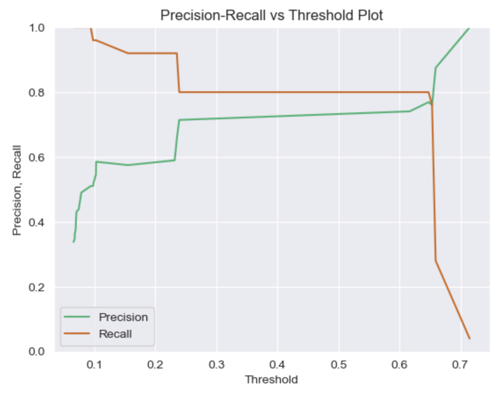

## Projects

---
### Antibiotic Resistance Prediction
As part of my 4th year research, I built a classification model to predict antibiotic resistance in the deadly pathogen *Pseudomonas Aeruginosa*. Specific emphasis was placed on optimizing the model's recall to minimize false negatives which could lead to deadly patient outcomes in a clinical setting.

[View code on Github](https://github.com/grahamgreene88/Antibiotic-Resistance-Prediction/blob/main/Antibiotic%20Resistance%20Prediction%20Notebook-Final.ipynb)

---
### Behavioural Customer Segmentation using RFM Analysis

[View code on Github](https://github.com/grahamgreene88/Behavioural-Segmentation/blob/main/Behavioural%20Customer%20Segmentation-Final.ipynb))

---
### Forest Fire Area Prediction

[View code on Github](http://example.com/)

---

---

---

Page template forked from <a href="https://github.com/evanca/quick-portfolio">evanca</a>

<!-- Remove above link if you don't want to attibute -->
