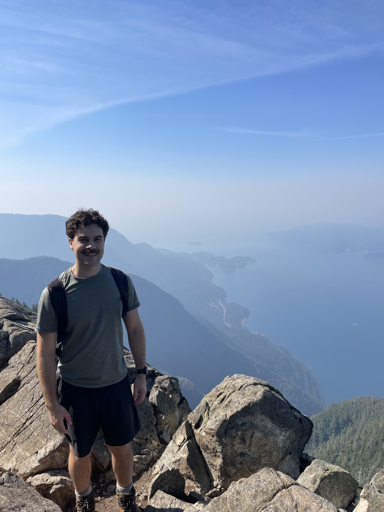

Just over two weeks ago I started orientation for the Master's of Data Science (MDS) program. The week went really fast and I met lots of cool people. There were lots of presentations as well as some team building activities. The orientation capped off with a Welcome Dinner where there was an alumni panel.

The day before orientation I did a hike to St. Mark's Summit in the North Shore Mountains with a few others from the program. It was great to meet a few classmates who also enjoy hiking. I'm hoping I can get out to do more hiking with them this fall.

 Although I knew the MDS program was quite intense, I was still surprised at the pace of the program, even coming from an engineering background. Having just completed the second week of classes though, I find I am starting to get into a good rythm. This will really be tested next week during which we have three major evaluations on top of our normal lectures and labs.

