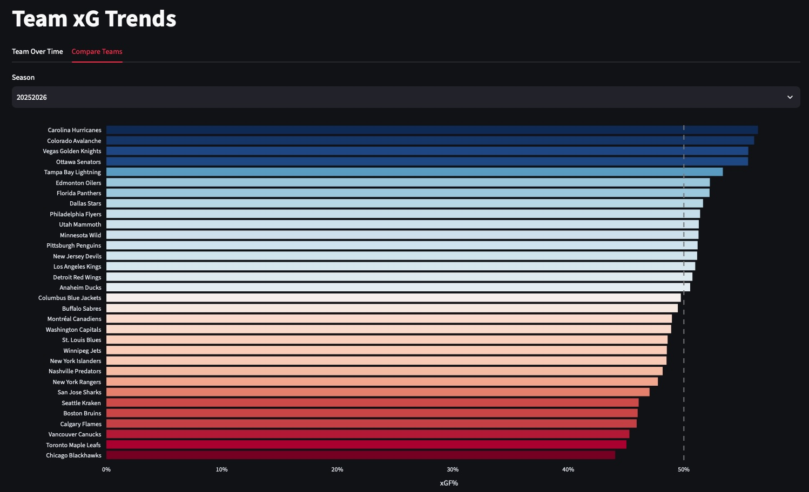

Link to deployed app: <https://xg-web-app.onrender.com>

The app may take a minute to wake up, this is expected.

Link to github repository: <https://github.com/grahamgreene88/Expected-Goals-xG-Model>

This project is an end-to-end machine learning application. The three main components of the project are:

1. Data pipelines that ingest play-by-play data daily from the NHL API and store in an Aiven cloud postgres database
2. An XGBoost ML xG model that was trained shot data from 2019-20 through 2024-25 and evaluted on the 2025-26 holdout test
3. Streamlit web app with shot explorer and team-level xG trends deployed to Render web service

For more detailed information, please visit the README file in the github repository linked above.

